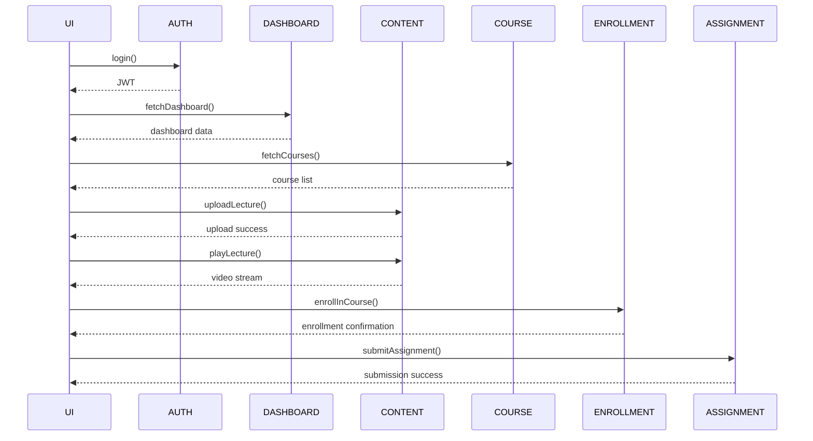

# Quick-Start Guideline: Component Mapping & Workflow Diagram

## Audience: Dev & QA Leads
### Outcome: Clean Mapping Sheet + Self-Explanatory Workflow Diagram

---

## 1. 5-Step Process

### Step 1: List Core Actions
- **Brainstorm every high-level user action** for Student, Teacher, Admin (e.g., Log in, View dashboard, Upload lecture).

### Step 2: Use the Mapping Template
- **Fill one row per action** using the provided mapping template.

### Step 3: Verify Ownership
- **Check that each component has a clear owning squad or microservice.**

### Step 4: Draft the Workflow Diagram
- **Sequence the actions** in a Mermaid diagram (or your favorite tool) to visualize request flow & agent hops.

### Step 5: QC Gate
- **Make sure every mapped service has at least one automated test and an alert metric.**

---

## 2. Mapping Template

Copy this table to a Google Sheet:

| #  | User Action          | UI Component     | API / Service | Data Store                     | AI / Worker | QC Check                          |
|----|----------------------|------------------|---------------|---------------------------------|-------------|-----------------------------------|
| 1  | Log in               | LoginPage        | auth-svc      | users table (PostgreSQL)       | none        | auth unit test, login alert rule  |
| 2  | View dashboard       | DashboardLayout   | dashboard-svc | user_dashboard table (PostgreSQL) | none        | dashboard E2E test, dashboard alert |
| 3  | Upload lecture       | UploadLecturePage | content-svc   | lectures bucket (MinIO)        | none        | upload unit test, upload alert rule |
| 4  | Play lecture video   | VideoPlayer      | content-svc   | lectures bucket (MinIO)        | none        | DRM token test, CDN latency <400 ms |
| 5  | Create course        | CreateCoursePage | course-svc    | courses table (PostgreSQL)     | none        | course creation unit test, alert rule |
| 6  | Enroll in course     | CourseView       | enrollment-svc| enrollments table (PostgreSQL) | none        | enrollment E2E test, alert rule   |
| 7  | Submit assignment     | AssignmentPage   | assignment-svc| assignments table (PostgreSQL) | none        | assignment submission test, alert rule |

*(Add rows as needed)*

---

## Quick Reference for Column Values

- **UI Component** – React component or page (e.g., LoginPage, DashboardLayout, QuizView).
- **API / Service** – FastAPI micro-service (e.g., auth-svc, course-svc).
- **Data Store** – PostgreSQL table, MinIO bucket, Redis key, etc.
- **AI / Worker** – Retrieval agent, LLM generator, cron retrainer, etc.
- **QC Check** – Unit test name, E2E test id, alert rule, lint.

---

## 3. Example Row (for reference)

| #  | User Action          | UI Component     | API / Service | Data Store                     | AI / Worker | QC Check                          |
|----|----------------------|------------------|---------------|---------------------------------|-------------|-----------------------------------|
| 7  | Play lecture video   | VideoPlayer      | content-svc   | lectures bucket (MinIO)        | none        | DRM token test, CDN latency <400 ms |

---

## 4. Building the Workflow Diagram

### Steps to Create the Diagram:
1. **Collect the rows from the sheet.**
2. **Group by service call order** (Auth → Course → Content, etc.).
3. **Use Mermaid syntax** like:

### Notes:
- Keep each hop label under 40 chars.
- Target total latency budget (P95): < 1 s.

---

## 5. Deliverables Checklist
- [ ] Mapping sheet complete & peer-reviewed
- [ ] Mermaid diagram committed to `/docs/flows/` folder (or PNG in Confluence)